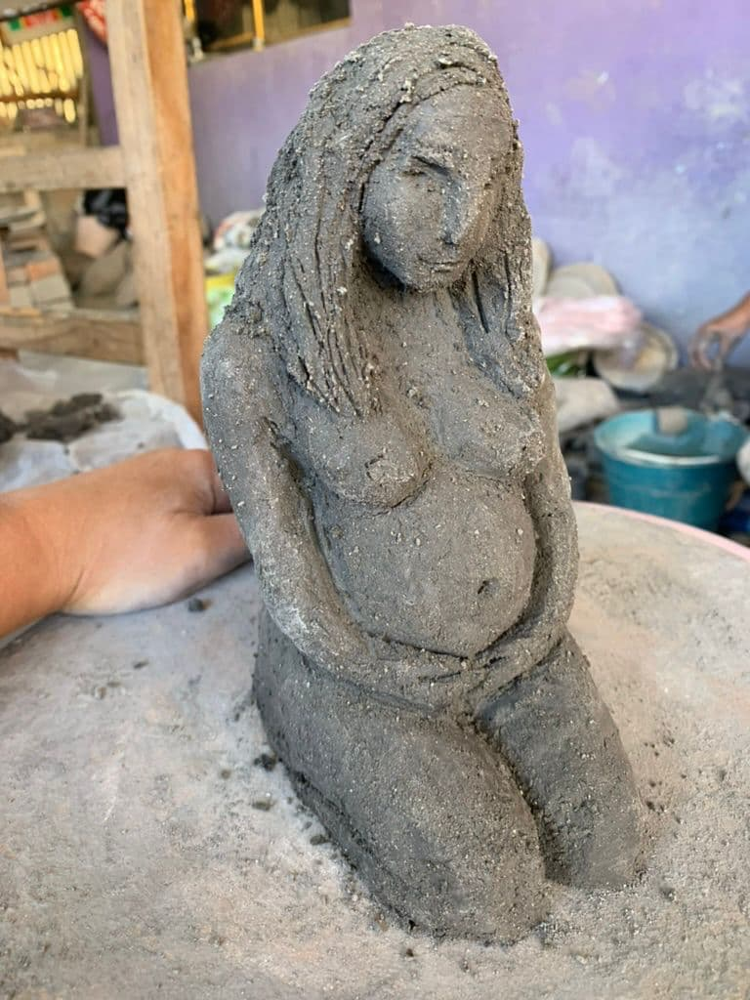
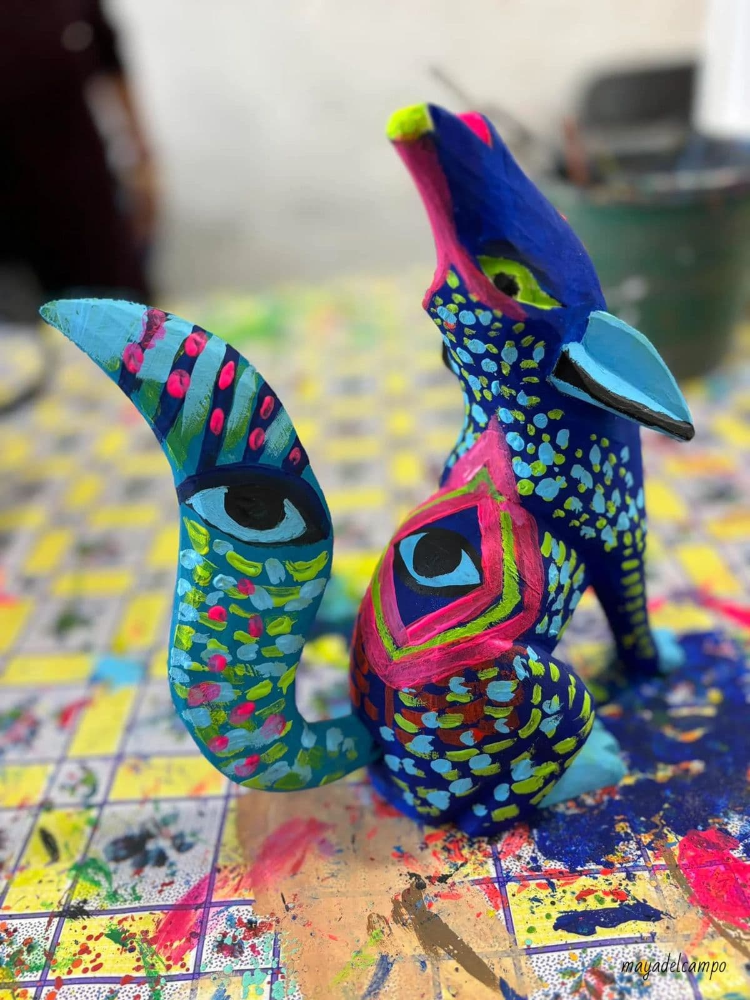

My artistic journey began with five years of training in oil painting in Paris under the mentorship of Patrice de Pracontal at the Atelier de Recherche Picturale. There, I learned to study and copy the Impressionist masters, discovering through practice the importance of contrast, light and shadow, harmony, and balance, principles that extend beyond art into life itself, and that mirror the relational attunement essential to the therapeutic alliance. 

In Barcelona, I immersed myself in Studio Nomada, where I explored contemporary practices including graffiti and performance art. These experiences taught me to embrace spontaneity, risk, and the dialogue between individual expression and public space, lessons that resonate with therapy as a co-created process, and with my research into how creativity fosters new forms of communication and resilience. 

In Mexico, I turned to clay and ritual installations, deeply inspired by the cultural traditions of Oaxaca, my husband’s hometown, where I regularly collaborate with local artists and craftswomen. Working with objects, earth, and ceremony revealed to me the power of materials and symbolic actions in holding memory and supporting healing, insights that continue to inform my clinical work and studies in psycho-oncology, grief, and community-based art practices. 

Beyond painting, I create sculptures, fabric art, and works on found objects and canvases, always exploring materiality as a metaphor for resilience and transformation. I also enjoy working with AI-generated art using Midjourney, digital creations, and immersive experiences in virtual reality with Multi-Brush, expanding my practice into new technological and sensory dimensions. 

Writing and spoken word performance remain integral to my work, where I weave words and images into immersive storytelling. I believe that creative expression is our universal birthright. Technique is not required to share one’s unique perception or contribute to collective culture; our sensibility and voice can emerge in many forms—on canvas, through natural or recycled materials, or even through the movement of our own bodies. 

My artwork has been exhibited internationally, including:

- MD Anderson Cancer Center, Pain Clinic (TX, USA, since 2024)
- Galerie le 18 bis (Paris, 2018)
- London Art Biennale (London, 2013)
- Art Paris (2012) • Galerie Étienne de Causans (Solo Show, Paris, 2011)
- IparkArt (Paris, 2010).

A curious optimist, Marie directed the docu-fiction “The Journey of the Blue Butterfly”, a poetic film born from encounters with optimistic strangers during a two-year backpacking trip around the world. You can watch it [here](https://www.youtube.com/watch?v=o7p0TvI8Iiw).

