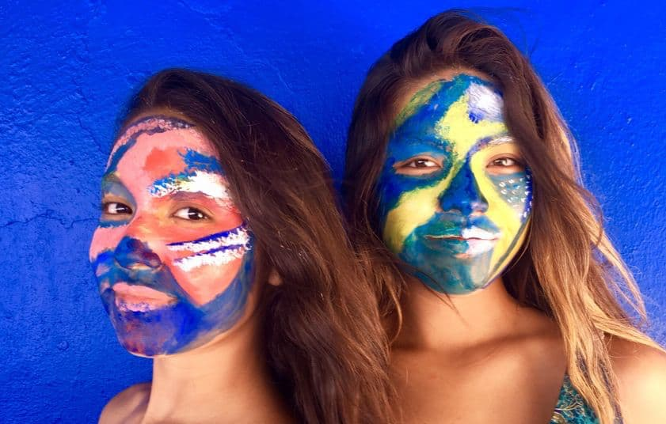

Collaboration is at the heart of my artistic practice. I thrive on creating one-of-a-kind performances and shared creative moments with others—whether it means transforming faces into living canvases, painting the music I hear as it unfolds on stage, or designing visuals that bring a filmmaker’s story to life. For me, the dialogue between art forms is endlessly inspiring: each collaboration is an experiment in presence, color, and imagination, where something unexpected and deeply human can emerge. 

A highlight of the past year was my live painting collaboration with classical musicians through the Neurosurgery Department at MD Anderson Cancer Center’s Music and Medicine series. In this setting, I translated sound into color and gesture in real time, inviting patients and audiences to join me in painting. Together, we turned music into a collective visual experience, an act that was both artistic performance and part of pioneering research on creativity, healing, and connection.

