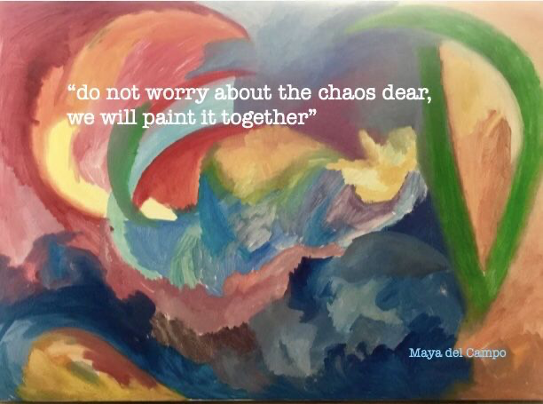

As a curious artist who seeks answers and feels the world deeply, I chose to become an art therapist—a mental health practice that uses creativity across many modalities to help individuals, families, and communities navigate life’s challenges and bloom. 

I am a Licensed Professional Counselor (LPC-A) and a Registered Art Therapist (ATR-P) in Texas, supporting children, teens, and adults through virtual art therapy and in-person group sessions. As a researcher, I completed a five-year PhD at Lesley University (Cambridge, USA), where I developed Icanfeel, an AI-powered software that supports the expression and monitoring of oncological symptoms, currently in clinical trial at MD Anderson Cancer Center (Houston, TX). 

Alongside clinical work, I serve as a professor of art therapy, training future therapists across Central and South America at the Instituto Mexicano de Psicoterapia de Arte, and as a Visiting Scholar at The New School University (NY), where my research focuses on the intersection of technology, art, and mental health. 

To learn more about art therapy or my current projects, please visit [curiousarttherapy.com](curiousarttherapy.com).
